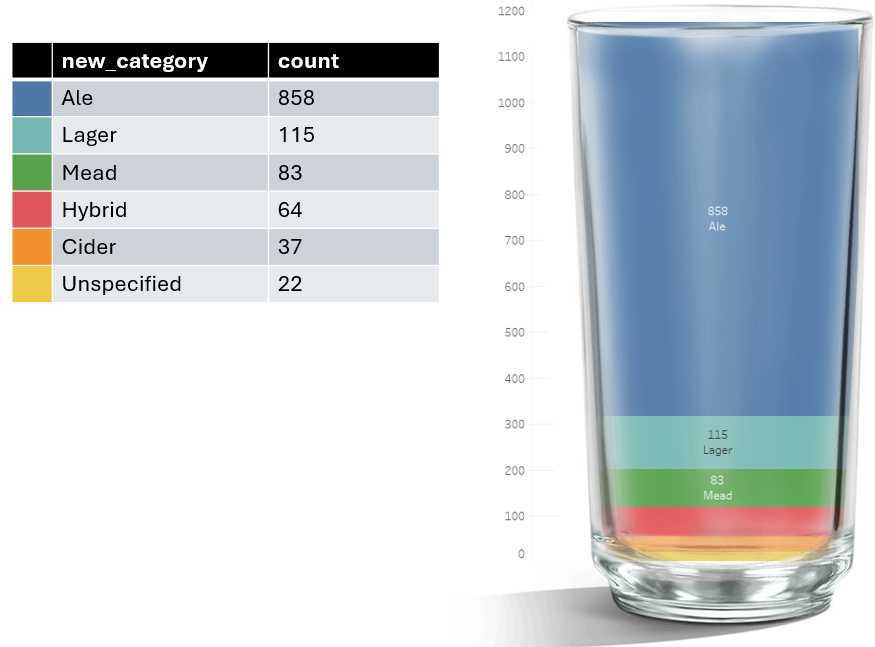
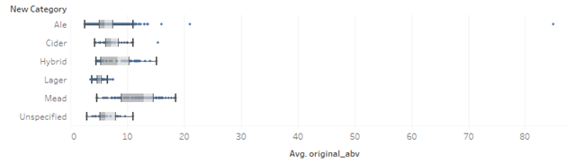

[Home](./README.md)

# Homebrew Recipe for Success
### Can we predict the end abv alcohol level of a beer from the ingredients used?

## Why would we want to do this?
This project is intended to optimise brewing techniques in ale’s by finding the relationship between ingredients and the resulting alcohol (abv) content to hit UK taxation thresholds.

## Methodology
Create a regression model to determine how quantities of ingredients, specifically sugar influence the final abv alcohol percentage.

## Sourcing and Cleaning
The dataset used is: https://www.kaggle.com/datasets/liviam/homebrew-recipes/data.  GDPR and data protection guidelines do not apply to this dataset as it is publicly available.
A combination of SQL server and Tableau was used for data cleaning and exploration due to the scalability and potential dashboarding of pipelines afforded by this (should it be expanded to a larger dataset if productionised in the future).
This Kaggle dataset included the ingredients, alcohol level and description of around 1171 drinks of different types.  Issues with missing data and inaccurate categorisations were addressed through normalisation and grouping techniques to produce a clean dataset.  No anonymisation was required as no sensitive data was present.

Each drink in the data set has an entry with numerical values for the following:

Abv- Alcohol by volume (percentage of pure alcohol)
Ibu- Internation Bitterness units (scale of perceived bitterness)
Srm – Standard Reference Method (where a beer falls on a colour spectrum)
Og- Original Gravity (A measure of solids e.g. sugar before fermentation)
Fg- Final Gravity (A measure of solids e.g. sugar after fermentation)
Rs – Residual Sugar (sugars that are still present after fermentation)

Data processing involved imputing missing values with averages and, normalising outliers to the maximum value for that drink type. To deal with missing categorisations, a new high-level category was created by consolidating subcategories and using wildcard values to extract from the drink name column.  This technique generated new categories with more entries to facilitate the creation of more robust models.

### Feature Engineering of Categorical Data
The drinks in the sample are split into three main types, Beer, Cider and Mead.

Count of entries per category:
Category	count
Beer		1140
Cider		37
Mead		93

Due to the higher sample size, beer would be most suitable for a regression model as smaller sample sizes risk poor performing overfitted models.

When comparing [category] to [master_type] it is noted that some of Beers could be categorized as Ales, some as Lagers, some as Hybrid with some unknowns.  These drinks require different brewing techniques and have a different target audience, so are worth separating for the proposed analysis; a wildcard lookup is used to extract key words where it appears in [master_type] or [name]. 

#### The output is added as a new column:
Category	new_category
Beer		Ale
Beer		Hybrid
Beer		Lager
Beer		Unspecified
Cider		Cider
Mead		Mead

### New Category Count
 

### Cleaning Numerical Data
Investigation into the numerical values uncovered null values in some columns; not all of these will be dealt with the same. 
Abv: As abv. Is the dependent variable and needs to be present and accurate, rows with missing values are dropped rather than using an average.
Other values: The average value for the relevant new_category are be used in its place.  This is not possible for ibu in the case of Cider as no values exist. 

### Dealing with outliers
#### Boxplot of Avb by Category
 

In two ales, the Abv is clearly much higher and is likely an outlier or data error.  In some rare cases an alcohol can reach these extreme levels, however as the maximum recorded abv for beer is 16% abv (World Population Review, 2025), these values are reduced to 16%, so preserving the drinks as high Abv, but not having them skew the dataset and affect averages.

## Data Analytics
The remaining analysis was performed in Python.

# Import Libs
import numpy as np
import pandas as pd
import pyodbc
import seaborn as sns
%matplotlib inline
from sklearn.model_selection import train_test_split
from sklearn.linear_model import LinearRegression
from sklearn.metrics import mean_absolute_error, mean_squared_error
import matplotlib.pyplot as plt
from sklearn.preprocessing import MinMaxScaler
from sklearn.preprocessing import StandardScaler
from sklearn.preprocessing import RobustScaler
import statsmodels.api as sm

